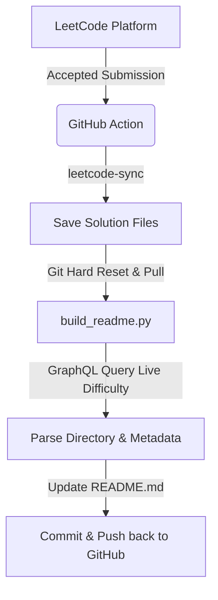

# 🏆 LeetCode Automator Hub

<p align="center">
  <a href="https://github.com/your-username/your-repo/actions/workflows/sync_leetcode.yml">
    
  </a>
  
  
  
  
  
</p>

---

## 📖 Project Overview & "How It Works"

**LeetCode Automator Hub** is a clean, automated synchronization pipeline that pulls your accepted LeetCode solutions, structures them into dedicated folders, and dynamically compiles an interactive dashboard tracking your coding progress.

### 🔄 Workflow Architecture



- **Sync Engine**: Powered by `leetcode-sync`, the action connects via session and CSRF credentials to pull latest solutions.
- **Documentation Builder**: `build_readme.py` queries the LeetCode GraphQL API to obtain live difficulty badges and constructs the statistics table.

---

## ✨ Key Features

- **🔄 Automated Weekly Synchronization**: Runs on a scheduled cron job (every Saturday) or on-demand manually.
- **📊 Interactive Statistics Dashboard**: Displays difficulty-wise counts (Easy, Medium, Hard) and total solutions solved.
- **📁 Structured Directory Mapping**: Automatically routes problems into folders like `0001-two-sum/` using zero-padded slug formats.
- **🚀 Live Difficulty Badging**: Queries official LeetCode GraphQL API endpoints rather than guessing or hardcoding difficulties.
- **💻 Multilingual Support**: Automatically detects solution file extensions (`.py`, `.cpp`, `.java`, `.sql`) to catalog languages used.

---

## 📁 Directory & Architecture Layout

```text
leetcode-automator-hub/
├── .github/
│   └── workflows/
│       └── sync_leetcode.yml     # GitHub Actions workflow automation
├── 0001-two-sum/                 # Auto-generated solution directory
│   └── two-sum.py                # Auto-generated solution file
├── build_readme.py               # Core Python generator script
└── README.md                     # Main documentation & dynamic dashboard
```

---

## ⚙️ Step-by-Step Installation & Setup Guide

Follow this guide to host your own LeetCode dashboard in a GitHub repository:

### 1. Copy Workflow and Script
Ensure your repository has these files:
- `.github/workflows/sync_leetcode.yml`
- `build_readme.py`

### 2. Retrieve LeetCode Session & CSRF Token
1. Go to [LeetCode](https://leetcode.com/) and sign in.
2. Press `F12` to open browser Developer Tools, and navigate to the **Network** tab.
3. Refresh the page or click on any query. Search for a request (e.g. `/api/...` or GraphQL requests).
4. Under **Headers** (specifically Request Headers) or the **Cookies** tab, find:
   - `LEETCODE_SESSION`
   - `csrftoken` (use this for `LEETCODE_CSRF_TOKEN`)

### 3. Add GitHub Repository Secrets
1. Navigate to your GitHub repository > **Settings** > **Secrets and variables** > **Actions**.
2. Click **New repository secret** and add:
   - Name: `LEETCODE_SESSION`, Value: *(your copied session cookie value)*
   - Name: `LEETCODE_CSRF_TOKEN`, Value: *(your copied csrf token value)*

### 4. Enable Workflow Write Permissions
For the action to commit modifications:
1. Go to **Settings** > **Actions** > **General**.
2. Scroll to **Workflow permissions**.
3. Choose **Read and write permissions**.
4. Click **Save**.

---

## 🚀 How to Run & Use the Project

### Scheduled Syncing
The pipeline is pre-configured to run automatically **every Saturday at 08:00 UTC** via the cron schedule in `.github/workflows/sync_leetcode.yml`.

### Manual Syncing
1. Go to the **Actions** tab of your repository.
2. Select **Sync LeetCode and Build Dashboard** on the left.
3. Click the **Run workflow** dropdown on the right and select **Run workflow**.

### Running Locally
To generate the dashboard locally, make sure you have python 3 installed, and run:
```bash
python build_readme.py
```

---

## 📊 Statistics

| Metric | Count |
| :--- | :--- |
| **Total Solved** | 175 |
| **Easy** | 132 |
| **Medium** | 39 |
| **Hard** | 4 |
| **Languages** | MySQL, Python 3, Java, C++ |
| **Last Updated** | 2026-07-14 09:08 UTC |

## 📁 Solutions

| # | Problem | Solution | Difficulty | Language | Date |
| :-: | :--- | :--- | :-: | :-: | :-: |
| 0001 | [Two Sum](https://leetcode.com/problems/two-sum/) | [0001-two-sum](./0001-two-sum) | Easy | Python 3 | 2026-07-14 |
| 0002 | [Add Two Numbers](https://leetcode.com/problems/add-two-numbers/) | [0002-add-two-numbers](./0002-add-two-numbers) | Medium | Python 3 | 2026-07-14 |
| 0003 | [Longest Substring Without Repeating Characters](https://leetcode.com/problems/longest-substring-without-repeating-characters/) | [0003-longest-substring-without-repeating-characters](./0003-longest-substring-without-repeating-characters) | Medium | Python 3 | 2026-07-14 |
| 0007 | [Reverse Integer](https://leetcode.com/problems/reverse-integer/) | [0007-reverse-integer](./0007-reverse-integer) | Medium | Python 3 | 2026-07-14 |
| 0009 | [Palindrome Number](https://leetcode.com/problems/palindrome-number/) | [0009-palindrome-number](./0009-palindrome-number) | Easy | Python 3 | 2026-07-14 |
| 0011 | [Container With Most Water](https://leetcode.com/problems/container-with-most-water/) | [0011-container-with-most-water](./0011-container-with-most-water) | Medium | Python 3 | 2026-07-14 |
| 0015 | [3Sum](https://leetcode.com/problems/3sum/) | [0015-3sum](./0015-3sum) | Medium | Python 3 | 2026-07-14 |
| 0019 | [Remove Nth Node From End of List](https://leetcode.com/problems/remove-nth-node-from-end-of-list/) | [0019-remove-nth-node-from-end-of-list](./0019-remove-nth-node-from-end-of-list) | Medium | Python 3 | 2026-07-14 |
| 0020 | [Valid Parentheses](https://leetcode.com/problems/valid-parentheses/) | [0020-valid-parentheses](./0020-valid-parentheses) | Easy | Python 3 | 2026-07-14 |
| 0021 | [Merge Two Sorted Lists](https://leetcode.com/problems/merge-two-sorted-lists/) | [0021-merge-two-sorted-lists](./0021-merge-two-sorted-lists) | Easy | Python 3 | 2026-07-14 |
| 0026 | [Remove Duplicates From Sorted Array](https://leetcode.com/problems/remove-duplicates-from-sorted-array/) | [0026-remove-duplicates-from-sorted-array](./0026-remove-duplicates-from-sorted-array) | Easy | Python 3 | 2026-07-14 |
| 0027 | [Remove Element](https://leetcode.com/problems/remove-element/) | [0027-remove-element](./0027-remove-element) | Easy | Python 3 | 2026-07-14 |
| 0028 | [Find The Index of The First Occurrence in A String](https://leetcode.com/problems/find-the-index-of-the-first-occurrence-in-a-string/) | [0028-find-the-index-of-the-first-occurrence-in-a-string](./0028-find-the-index-of-the-first-occurrence-in-a-string) | Easy | Python 3 | 2026-07-14 |
| 0034 | [Find First and Last Position of Element in Sorted Array](https://leetcode.com/problems/find-first-and-last-position-of-element-in-sorted-array/) | [0034-find-first-and-last-position-of-element-in-sorted-array](./0034-find-first-and-last-position-of-element-in-sorted-array) | Medium | Python 3 | 2026-07-14 |
| 0035 | [Search Insert Position](https://leetcode.com/problems/search-insert-position/) | [0035-search-insert-position](./0035-search-insert-position) | Easy | Python 3 | 2026-07-14 |
| 0042 | [Trapping Rain Water](https://leetcode.com/problems/trapping-rain-water/) | [0042-trapping-rain-water](./0042-trapping-rain-water) | Hard | Python 3 | 2026-07-14 |
| 0046 | [Permutations](https://leetcode.com/problems/permutations/) | [0046-permutations](./0046-permutations) | Medium | Python 3 | 2026-07-14 |
| 0047 | [Permutations Ii](https://leetcode.com/problems/permutations-ii/) | [0047-permutations-ii](./0047-permutations-ii) | Medium | Python 3 | 2026-07-14 |
| 0050 | [Powx N](https://leetcode.com/problems/powx-n/) | [0050-powx-n](./0050-powx-n) | Medium | Python 3 | 2026-07-14 |
| 0051 | [N Queens](https://leetcode.com/problems/n-queens/) | [0051-n-queens](./0051-n-queens) | Hard | Python 3 | 2026-07-14 |
| 0058 | [Length of Last Word](https://leetcode.com/problems/length-of-last-word/) | [0058-length-of-last-word](./0058-length-of-last-word) | Easy | Python 3 | 2026-07-14 |
| 0061 | [Rotate List](https://leetcode.com/problems/rotate-list/) | [0061-rotate-list](./0061-rotate-list) | Medium | Python 3 | 2026-07-14 |
| 0067 | [Add Binary](https://leetcode.com/problems/add-binary/) | [0067-add-binary](./0067-add-binary) | Easy | Python 3 | 2026-07-14 |
| 0069 | [Sqrtx](https://leetcode.com/problems/sqrtx/) | [0069-sqrtx](./0069-sqrtx) | Easy | Python 3 | 2026-07-14 |
| 0075 | [Sort Colors](https://leetcode.com/problems/sort-colors/) | [0075-sort-colors](./0075-sort-colors) | Medium | Python 3 | 2026-07-14 |
| 0078 | [Subsets](https://leetcode.com/problems/subsets/) | [0078-subsets](./0078-subsets) | Medium | Python 3 | 2026-07-14 |
| 0083 | [Remove Duplicates From Sorted List](https://leetcode.com/problems/remove-duplicates-from-sorted-list/) | [0083-remove-duplicates-from-sorted-list](./0083-remove-duplicates-from-sorted-list) | Easy | Python 3 | 2026-07-14 |
| 0094 | [Binary Tree Inorder Traversal](https://leetcode.com/problems/binary-tree-inorder-traversal/) | [0094-binary-tree-inorder-traversal](./0094-binary-tree-inorder-traversal) | Easy | Python 3 | 2026-07-14 |
| 0100 | [Same Tree](https://leetcode.com/problems/same-tree/) | [0100-same-tree](./0100-same-tree) | Easy | Python 3 | 2026-07-14 |
| 0102 | [Binary Tree Level Order Traversal](https://leetcode.com/problems/binary-tree-level-order-traversal/) | [0102-binary-tree-level-order-traversal](./0102-binary-tree-level-order-traversal) | Medium | Python 3 | 2026-07-14 |
| 0103 | [Binary Tree Zigzag Level Order Traversal](https://leetcode.com/problems/binary-tree-zigzag-level-order-traversal/) | [0103-binary-tree-zigzag-level-order-traversal](./0103-binary-tree-zigzag-level-order-traversal) | Medium | Python 3 | 2026-07-14 |
| 0104 | [Maximum Depth of Binary Tree](https://leetcode.com/problems/maximum-depth-of-binary-tree/) | [0104-maximum-depth-of-binary-tree](./0104-maximum-depth-of-binary-tree) | Easy | Python 3 | 2026-07-14 |
| 0107 | [Binary Tree Level Order Traversal Ii](https://leetcode.com/problems/binary-tree-level-order-traversal-ii/) | [0107-binary-tree-level-order-traversal-ii](./0107-binary-tree-level-order-traversal-ii) | Medium | Python 3 | 2026-07-14 |
| 0110 | [Balanced Binary Tree](https://leetcode.com/problems/balanced-binary-tree/) | [0110-balanced-binary-tree](./0110-balanced-binary-tree) | Easy | Python 3 | 2026-07-14 |
| 0111 | [Minimum Depth of Binary Tree](https://leetcode.com/problems/minimum-depth-of-binary-tree/) | [0111-minimum-depth-of-binary-tree](./0111-minimum-depth-of-binary-tree) | Easy | Python 3 | 2026-07-14 |
| 0124 | [Binary Tree Maximum Path Sum](https://leetcode.com/problems/binary-tree-maximum-path-sum/) | [0124-binary-tree-maximum-path-sum](./0124-binary-tree-maximum-path-sum) | Hard | Python 3 | 2026-07-14 |
| 0125 | [Valid Palindrome](https://leetcode.com/problems/valid-palindrome/) | [0125-valid-palindrome](./0125-valid-palindrome) | Easy | Python 3 | 2026-07-14 |
| 0136 | [Single Number](https://leetcode.com/problems/single-number/) | [0136-single-number](./0136-single-number) | Easy | Python 3 | 2026-07-14 |
| 0141 | [Linked List Cycle](https://leetcode.com/problems/linked-list-cycle/) | [0141-linked-list-cycle](./0141-linked-list-cycle) | Easy | Python 3 | 2026-07-14 |
| 0144 | [Binary Tree Preorder Traversal](https://leetcode.com/problems/binary-tree-preorder-traversal/) | [0144-binary-tree-preorder-traversal](./0144-binary-tree-preorder-traversal) | Easy | Python 3 | 2026-07-14 |
| 0145 | [Binary Tree Postorder Traversal](https://leetcode.com/problems/binary-tree-postorder-traversal/) | [0145-binary-tree-postorder-traversal](./0145-binary-tree-postorder-traversal) | Easy | Python 3 | 2026-07-14 |
| 0148 | [Sort List](https://leetcode.com/problems/sort-list/) | [0148-sort-list](./0148-sort-list) | Medium | Python 3 | 2026-07-14 |
| 0155 | [Min Stack](https://leetcode.com/problems/min-stack/) | [0155-min-stack](./0155-min-stack) | Medium | Python 3 | 2026-07-14 |
| 0160 | [Intersection of Two Linked Lists](https://leetcode.com/problems/intersection-of-two-linked-lists/) | [0160-intersection-of-two-linked-lists](./0160-intersection-of-two-linked-lists) | Easy | Python 3 | 2026-07-14 |
| 0167 | [Two Sum Ii   Input Array Is Sorted](https://leetcode.com/problems/two-sum-ii---input-array-is-sorted/) | [0167-two-sum-ii---input-array-is-sorted](./0167-two-sum-ii---input-array-is-sorted) | Easy | Python 3 | 2026-07-14 |
| 0168 | [Excel Sheet Column Title](https://leetcode.com/problems/excel-sheet-column-title/) | [0168-excel-sheet-column-title](./0168-excel-sheet-column-title) | Easy | Python 3 | 2026-07-14 |
| 0169 | [Majority Element](https://leetcode.com/problems/majority-element/) | [0169-majority-element](./0169-majority-element) | Easy | Python 3 | 2026-07-14 |
| 0171 | [Excel Sheet Column Number](https://leetcode.com/problems/excel-sheet-column-number/) | [0171-excel-sheet-column-number](./0171-excel-sheet-column-number) | Easy | Python 3 | 2026-07-14 |
| 0189 | [Rotate Array](https://leetcode.com/problems/rotate-array/) | [0189-rotate-array](./0189-rotate-array) | Medium | Python 3 | 2026-07-14 |
| 0191 | [Number of 1 Bits](https://leetcode.com/problems/number-of-1-bits/) | [0191-number-of-1-bits](./0191-number-of-1-bits) | Easy | Python 3 | 2026-07-14 |
| 0202 | [Happy Number](https://leetcode.com/problems/happy-number/) | [0202-happy-number](./0202-happy-number) | Easy | Python 3 | 2026-07-14 |
| 0203 | [Remove Linked List Elements](https://leetcode.com/problems/remove-linked-list-elements/) | [0203-remove-linked-list-elements](./0203-remove-linked-list-elements) | Easy | Python 3 | 2026-07-14 |
| 0206 | [Reverse Linked List](https://leetcode.com/problems/reverse-linked-list/) | [0206-reverse-linked-list](./0206-reverse-linked-list) | Easy | Python 3 | 2026-07-14 |
| 0209 | [Minimum Size Subarray Sum](https://leetcode.com/problems/minimum-size-subarray-sum/) | [0209-minimum-size-subarray-sum](./0209-minimum-size-subarray-sum) | Medium | Python 3 | 2026-07-14 |
| 0215 | [Kth Largest Element in An Array](https://leetcode.com/problems/kth-largest-element-in-an-array/) | [0215-kth-largest-element-in-an-array](./0215-kth-largest-element-in-an-array) | Medium | Python 3 | 2026-07-14 |
| 0225 | [Implement Stack Using Queues](https://leetcode.com/problems/implement-stack-using-queues/) | [0225-implement-stack-using-queues](./0225-implement-stack-using-queues) | Easy | Python 3 | 2026-07-14 |
| 0226 | [Invert Binary Tree](https://leetcode.com/problems/invert-binary-tree/) | [0226-invert-binary-tree](./0226-invert-binary-tree) | Easy | Python 3 | 2026-07-14 |
| 0229 | [Majority Element Ii](https://leetcode.com/problems/majority-element-ii/) | [0229-majority-element-ii](./0229-majority-element-ii) | Medium | Python 3 | 2026-07-14 |
| 0230 | [Kth Smallest Element in A Bst](https://leetcode.com/problems/kth-smallest-element-in-a-bst/) | [0230-kth-smallest-element-in-a-bst](./0230-kth-smallest-element-in-a-bst) | Medium | Python 3 | 2026-07-14 |
| 0231 | [Power of Two](https://leetcode.com/problems/power-of-two/) | [0231-power-of-two](./0231-power-of-two) | Easy | Python 3 | 2026-07-14 |
| 0232 | [Implement Queue Using Stacks](https://leetcode.com/problems/implement-queue-using-stacks/) | [0232-implement-queue-using-stacks](./0232-implement-queue-using-stacks) | Easy | Python 3 | 2026-07-14 |
| 0234 | [Palindrome Linked List](https://leetcode.com/problems/palindrome-linked-list/) | [0234-palindrome-linked-list](./0234-palindrome-linked-list) | Easy | Python 3 | 2026-07-14 |
| 0237 | [Delete Node in A Linked List](https://leetcode.com/problems/delete-node-in-a-linked-list/) | [0237-delete-node-in-a-linked-list](./0237-delete-node-in-a-linked-list) | Medium | Python 3 | 2026-07-14 |
| 0242 | [Valid Anagram](https://leetcode.com/problems/valid-anagram/) | [0242-valid-anagram](./0242-valid-anagram) | Easy | Python 3 | 2026-07-14 |
| 0258 | [Add Digits](https://leetcode.com/problems/add-digits/) | [0258-add-digits](./0258-add-digits) | Easy | Python 3 | 2026-07-14 |
| 0260 | [Single Number Iii](https://leetcode.com/problems/single-number-iii/) | [0260-single-number-iii](./0260-single-number-iii) | Medium | Python 3 | 2026-07-14 |
| 0263 | [Ugly Number](https://leetcode.com/problems/ugly-number/) | [0263-ugly-number](./0263-ugly-number) | Easy | Python 3 | 2026-07-14 |
| 0268 | [Missing Number](https://leetcode.com/problems/missing-number/) | [0268-missing-number](./0268-missing-number) | Easy | Python 3 | 2026-07-14 |
| 0283 | [Move Zeroes](https://leetcode.com/problems/move-zeroes/) | [0283-move-zeroes](./0283-move-zeroes) | Easy | Python 3 | 2026-07-14 |
| 0287 | [Find The Duplicate Number](https://leetcode.com/problems/find-the-duplicate-number/) | [0287-find-the-duplicate-number](./0287-find-the-duplicate-number) | Medium | Python 3 | 2026-07-14 |
| 0292 | [Nim Game](https://leetcode.com/problems/nim-game/) | [0292-nim-game](./0292-nim-game) | Easy | Python 3 | 2026-07-14 |
| 0319 | [Bulb Switcher](https://leetcode.com/problems/bulb-switcher/) | [0319-bulb-switcher](./0319-bulb-switcher) | Medium | Python 3 | 2026-07-14 |
| 0326 | [Power of Three](https://leetcode.com/problems/power-of-three/) | [0326-power-of-three](./0326-power-of-three) | Easy | Python 3 | 2026-07-14 |
| 0328 | [Odd Even Linked List](https://leetcode.com/problems/odd-even-linked-list/) | [0328-odd-even-linked-list](./0328-odd-even-linked-list) | Medium | Python 3 | 2026-07-14 |
| 0342 | [Power of Four](https://leetcode.com/problems/power-of-four/) | [0342-power-of-four](./0342-power-of-four) | Easy | Python 3 | 2026-07-14 |
| 0344 | [Reverse String](https://leetcode.com/problems/reverse-string/) | [0344-reverse-string](./0344-reverse-string) | Easy | Python 3 | 2026-07-14 |
| 0345 | [Reverse Vowels of A String](https://leetcode.com/problems/reverse-vowels-of-a-string/) | [0345-reverse-vowels-of-a-string](./0345-reverse-vowels-of-a-string) | Easy | Python 3 | 2026-07-14 |
| 0347 | [Top K Frequent Elements](https://leetcode.com/problems/top-k-frequent-elements/) | [0347-top-k-frequent-elements](./0347-top-k-frequent-elements) | Medium | Python 3 | 2026-07-14 |
| 0367 | [Valid Perfect Square](https://leetcode.com/problems/valid-perfect-square/) | [0367-valid-perfect-square](./0367-valid-perfect-square) | Easy | Python 3 | 2026-07-14 |
| 0383 | [Ransom Note](https://leetcode.com/problems/ransom-note/) | [0383-ransom-note](./0383-ransom-note) | Easy | Python 3 | 2026-07-14 |
| 0387 | [First Unique Character in A String](https://leetcode.com/problems/first-unique-character-in-a-string/) | [0387-first-unique-character-in-a-string](./0387-first-unique-character-in-a-string) | Easy | Python 3 | 2026-07-14 |
| 0389 | [Find The Difference](https://leetcode.com/problems/find-the-difference/) | [0389-find-the-difference](./0389-find-the-difference) | Easy | Python 3 | 2026-07-14 |
| 0412 | [Fizz Buzz](https://leetcode.com/problems/fizz-buzz/) | [0412-fizz-buzz](./0412-fizz-buzz) | Easy | Python 3 | 2026-07-14 |
| 0434 | [Number of Segments in A String](https://leetcode.com/problems/number-of-segments-in-a-string/) | [0434-number-of-segments-in-a-string](./0434-number-of-segments-in-a-string) | Easy | Python 3 | 2026-07-14 |
| 0448 | [Find All Numbers Disappeared in An Array](https://leetcode.com/problems/find-all-numbers-disappeared-in-an-array/) | [0448-find-all-numbers-disappeared-in-an-array](./0448-find-all-numbers-disappeared-in-an-array) | Easy | Python 3 | 2026-07-14 |
| 0460 | [Lfu Cache](https://leetcode.com/problems/lfu-cache/) | [0460-lfu-cache](./0460-lfu-cache) | Hard | Python 3 | 2026-07-14 |
| 0520 | [Detect Capital](https://leetcode.com/problems/detect-capital/) | [0520-detect-capital](./0520-detect-capital) | Easy | Python 3 | 2026-07-14 |
| 0557 | [Reverse Words in A String Iii](https://leetcode.com/problems/reverse-words-in-a-string-iii/) | [0557-reverse-words-in-a-string-iii](./0557-reverse-words-in-a-string-iii) | Easy | Python 3 | 2026-07-14 |
| 0617 | [Merge Two Binary Trees](https://leetcode.com/problems/merge-two-binary-trees/) | [0617-merge-two-binary-trees](./0617-merge-two-binary-trees) | Easy | Python 3 | 2026-07-14 |
| 0637 | [Average of Levels in Binary Tree](https://leetcode.com/problems/average-of-levels-in-binary-tree/) | [0637-average-of-levels-in-binary-tree](./0637-average-of-levels-in-binary-tree) | Easy | Python 3 | 2026-07-14 |
| 0643 | [Maximum Average Subarray I](https://leetcode.com/problems/maximum-average-subarray-i/) | [0643-maximum-average-subarray-i](./0643-maximum-average-subarray-i) | Easy | Python 3 | 2026-07-14 |
| 0657 | [Robot Return to Origin](https://leetcode.com/problems/robot-return-to-origin/) | [0657-robot-return-to-origin](./0657-robot-return-to-origin) | Easy | Python 3 | 2026-07-14 |
| 0671 | [Second Minimum Node in A Binary Tree](https://leetcode.com/problems/second-minimum-node-in-a-binary-tree/) | [0671-second-minimum-node-in-a-binary-tree](./0671-second-minimum-node-in-a-binary-tree) | Easy | Python 3 | 2026-07-14 |
| 0682 | [Baseball Game](https://leetcode.com/problems/baseball-game/) | [0682-baseball-game](./0682-baseball-game) | Easy | Python 3 | 2026-07-14 |
| 0692 | [Top K Frequent Words](https://leetcode.com/problems/top-k-frequent-words/) | [0692-top-k-frequent-words](./0692-top-k-frequent-words) | Medium | Python 3 | 2026-07-14 |
| 0728 | [Self Dividing Numbers](https://leetcode.com/problems/self-dividing-numbers/) | [0728-self-dividing-numbers](./0728-self-dividing-numbers) | Easy | Python 3 | 2026-07-14 |
| 0739 | [Daily Temperatures](https://leetcode.com/problems/daily-temperatures/) | [0739-daily-temperatures](./0739-daily-temperatures) | Medium | Python 3 | 2026-07-14 |
| 0742 | [to Lower Case](https://leetcode.com/problems/to-lower-case/) | [0742-to-lower-case](./0742-to-lower-case) | Easy | Python 3 | 2026-07-14 |
| 0783 | [Search in A Binary Search Tree](https://leetcode.com/problems/search-in-a-binary-search-tree/) | [0783-search-in-a-binary-search-tree](./0783-search-in-a-binary-search-tree) | Easy | Python 3 | 2026-07-14 |
| 0784 | [Insert Into A Binary Search Tree](https://leetcode.com/problems/insert-into-a-binary-search-tree/) | [0784-insert-into-a-binary-search-tree](./0784-insert-into-a-binary-search-tree) | Medium | Python 3 | 2026-07-14 |
| 0792 | [Binary Search](https://leetcode.com/problems/binary-search/) | [0792-binary-search](./0792-binary-search) | Easy | Python 3 | 2026-07-14 |
| 0812 | [Rotate String](https://leetcode.com/problems/rotate-string/) | [0812-rotate-string](./0812-rotate-string) | Easy | Python 3 | 2026-07-14 |
| 0816 | [Design Hashset](https://leetcode.com/problems/design-hashset/) | [0816-design-hashset](./0816-design-hashset) | Easy | Python 3 | 2026-07-14 |
| 0822 | [Unique Morse Code Words](https://leetcode.com/problems/unique-morse-code-words/) | [0822-unique-morse-code-words](./0822-unique-morse-code-words) | Easy | Python 3 | 2026-07-14 |
| 0851 | [Goat Latin](https://leetcode.com/problems/goat-latin/) | [0851-goat-latin](./0851-goat-latin) | Easy | Python 3 | 2026-07-14 |
| 0859 | [Design Circular Deque](https://leetcode.com/problems/design-circular-deque/) | [0859-design-circular-deque](./0859-design-circular-deque) | Medium | Python 3 | 2026-07-14 |
| 0860 | [Design Circular Queue](https://leetcode.com/problems/design-circular-queue/) | [0860-design-circular-queue](./0860-design-circular-queue) | Medium | Python 3 | 2026-07-14 |
| 0907 | [Koko Eating Bananas](https://leetcode.com/problems/koko-eating-bananas/) | [0907-koko-eating-bananas](./0907-koko-eating-bananas) | Medium | Python 3 | 2026-07-14 |
| 0908 | [Middle of The Linked List](https://leetcode.com/problems/middle-of-the-linked-list/) | [0908-middle-of-the-linked-list](./0908-middle-of-the-linked-list) | Easy | Python 3 | 2026-07-14 |
| 0953 | [Reverse Only Letters](https://leetcode.com/problems/reverse-only-letters/) | [0953-reverse-only-letters](./0953-reverse-only-letters) | Easy | Python 3 | 2026-07-14 |
| 0969 | [Number of Recent Calls](https://leetcode.com/problems/number-of-recent-calls/) | [0969-number-of-recent-calls](./0969-number-of-recent-calls) | Easy | Python 3 | 2026-07-14 |
| 0975 | [Range Sum of Bst](https://leetcode.com/problems/range-sum-of-bst/) | [0975-range-sum-of-bst](./0975-range-sum-of-bst) | Easy | Python 3 | 2026-07-14 |
| 1001 | [N Repeated Element in Size 2N Array](https://leetcode.com/problems/n-repeated-element-in-size-2n-array/) | [1001-n-repeated-element-in-size-2n-array](./1001-n-repeated-element-in-size-2n-array) | Easy | Python 3 | 2026-07-14 |
| 1013 | [Fibonacci Number](https://leetcode.com/problems/fibonacci-number/) | [1013-fibonacci-number](./1013-fibonacci-number) | Easy | Python 3 | 2026-07-14 |
| 1014 | [K Closest Points to Origin](https://leetcode.com/problems/k-closest-points-to-origin/) | [1014-k-closest-points-to-origin](./1014-k-closest-points-to-origin) | Medium | Python 3 | 2026-07-14 |
| 1031 | [Add to Array Form of Integer](https://leetcode.com/problems/add-to-array-form-of-integer/) | [1031-add-to-array-form-of-integer](./1031-add-to-array-form-of-integer) | Easy | Python 3 | 2026-07-14 |
| 1086 | [Divisor Game](https://leetcode.com/problems/divisor-game/) | [1086-divisor-game](./1086-divisor-game) | Easy | Python 3 | 2026-07-14 |
| 1127 | [Last Stone Weight](https://leetcode.com/problems/last-stone-weight/) | [1127-last-stone-weight](./1127-last-stone-weight) | Easy | Python 3 | 2026-07-14 |
| 1128 | [Remove All Adjacent Duplicates in String](https://leetcode.com/problems/remove-all-adjacent-duplicates-in-string/) | [1128-remove-all-adjacent-duplicates-in-string](./1128-remove-all-adjacent-duplicates-in-string) | Easy | Python 3 | 2026-07-14 |
| 1146 | [Greatest Common Divisor of Strings](https://leetcode.com/problems/greatest-common-divisor-of-strings/) | [1146-greatest-common-divisor-of-strings](./1146-greatest-common-divisor-of-strings) | Easy | Python 3 | 2026-07-14 |
| 1205 | [Defanging An Ip Address](https://leetcode.com/problems/defanging-an-ip-address/) | [1205-defanging-an-ip-address](./1205-defanging-an-ip-address) | Easy | Python 3 | 2026-07-14 |
| 1236 | [N Th Tribonacci Number](https://leetcode.com/problems/n-th-tribonacci-number/) | [1236-n-th-tribonacci-number](./1236-n-th-tribonacci-number) | Easy | Python 3 | 2026-07-14 |
| 1260 | [Day of The Year](https://leetcode.com/problems/day-of-the-year/) | [1260-day-of-the-year](./1260-day-of-the-year) | Easy | Python 3 | 2026-07-14 |
| 1289 | [Day of The Week](https://leetcode.com/problems/day-of-the-week/) | [1289-day-of-the-week](./1289-day-of-the-week) | Easy | Python 3 | 2026-07-14 |
| 1293 | [Three Consecutive Odds](https://leetcode.com/problems/three-consecutive-odds/) | [1293-three-consecutive-odds](./1293-three-consecutive-odds) | Easy | Python 3 | 2026-07-14 |
| 1406 | [Subtract The Product and Sum of Digits of An Integer](https://leetcode.com/problems/subtract-the-product-and-sum-of-digits-of-an-integer/) | [1406-subtract-the-product-and-sum-of-digits-of-an-integer](./1406-subtract-the-product-and-sum-of-digits-of-an-integer) | Easy | Python 3 | 2026-07-14 |
| 1411 | [Convert Binary Number in A Linked List to Integer](https://leetcode.com/problems/convert-binary-number-in-a-linked-list-to-integer/) | [1411-convert-binary-number-in-a-linked-list-to-integer](./1411-convert-binary-number-in-a-linked-list-to-integer) | Easy | Python 3 | 2026-07-14 |
| 1468 | [Check If N and Its Double Exist](https://leetcode.com/problems/check-if-n-and-its-double-exist/) | [1468-check-if-n-and-its-double-exist](./1468-check-if-n-and-its-double-exist) | Easy | Python 3 | 2026-07-14 |
| 1482 | [How Many Numbers Are Smaller Than The Current Number](https://leetcode.com/problems/how-many-numbers-are-smaller-than-the-current-number/) | [1482-how-many-numbers-are-smaller-than-the-current-number](./1482-how-many-numbers-are-smaller-than-the-current-number) | Easy | Python 3 | 2026-07-14 |
| 1490 | [Generate A String With Characters That Have Odd Counts](https://leetcode.com/problems/generate-a-string-with-characters-that-have-odd-counts/) | [1490-generate-a-string-with-characters-that-have-odd-counts](./1490-generate-a-string-with-characters-that-have-odd-counts) | Easy | Python 3 | 2026-07-14 |
| 1500 | [Count Largest Group](https://leetcode.com/problems/count-largest-group/) | [1500-count-largest-group](./1500-count-largest-group) | Easy | Python 3 | 2026-07-14 |
| 1510 | [Find Lucky Integer in An Array](https://leetcode.com/problems/find-lucky-integer-in-an-array/) | [1510-find-lucky-integer-in-an-array](./1510-find-lucky-integer-in-an-array) | Easy | Python 3 | 2026-07-14 |
| 1566 | [Check If A Word Occurs As A Prefix of Any Word in A Sentence](https://leetcode.com/problems/check-if-a-word-occurs-as-a-prefix-of-any-word-in-a-sentence/) | [1566-check-if-a-word-occurs-as-a-prefix-of-any-word-in-a-sentence](./1566-check-if-a-word-occurs-as-a-prefix-of-any-word-in-a-sentence) | Easy | Python 3 | 2026-07-14 |
| 1574 | [Maximum Product of Two Elements in An Array](https://leetcode.com/problems/maximum-product-of-two-elements-in-an-array/) | [1574-maximum-product-of-two-elements-in-an-array](./1574-maximum-product-of-two-elements-in-an-array) | Easy | Python 3 | 2026-07-14 |
| 1603 | [Running Sum of 1D Array](https://leetcode.com/problems/running-sum-of-1d-array/) | [1603-running-sum-of-1d-array](./1603-running-sum-of-1d-array) | Easy | Python 3 | 2026-07-14 |
| 1630 | [Count Odd Numbers in An Interval Range](https://leetcode.com/problems/count-odd-numbers-in-an-interval-range/) | [1630-count-odd-numbers-in-an-interval-range](./1630-count-odd-numbers-in-an-interval-range) | Easy | Python 3 | 2026-07-14 |
| 1635 | [Number of Good Pairs](https://leetcode.com/problems/number-of-good-pairs/) | [1635-number-of-good-pairs](./1635-number-of-good-pairs) | Easy | Python 3 | 2026-07-14 |
| 1666 | [Make The String Great](https://leetcode.com/problems/make-the-string-great/) | [1666-make-the-string-great](./1666-make-the-string-great) | Easy | Python 3 | 2026-07-14 |
| 1737 | [Maximum Nesting Depth of The Parentheses](https://leetcode.com/problems/maximum-nesting-depth-of-the-parentheses/) | [1737-maximum-nesting-depth-of-the-parentheses](./1737-maximum-nesting-depth-of-the-parentheses) | Easy | Python 3 | 2026-07-14 |
| 1781 | [Check If Two String Arrays Are Equivalent](https://leetcode.com/problems/check-if-two-string-arrays-are-equivalent/) | [1781-check-if-two-string-arrays-are-equivalent](./1781-check-if-two-string-arrays-are-equivalent) | Easy | Python 3 | 2026-07-14 |
| 1786 | [Count The Number of Consistent Strings](https://leetcode.com/problems/count-the-number-of-consistent-strings/) | [1786-count-the-number-of-consistent-strings](./1786-count-the-number-of-consistent-strings) | Easy | Python 3 | 2026-07-14 |
| 1806 | [Count of Matches in Tournament](https://leetcode.com/problems/count-of-matches-in-tournament/) | [1806-count-of-matches-in-tournament](./1806-count-of-matches-in-tournament) | Easy | Python 3 | 2026-07-14 |
| 1848 | [Sum of Unique Elements](https://leetcode.com/problems/sum-of-unique-elements/) | [1848-sum-of-unique-elements](./1848-sum-of-unique-elements) | Easy | Python 3 | 2026-07-14 |
| 1878 | [Check If Array Is Sorted and Rotated](https://leetcode.com/problems/check-if-array-is-sorted-and-rotated/) | [1878-check-if-array-is-sorted-and-rotated](./1878-check-if-array-is-sorted-and-rotated) | Easy | Python 3 | 2026-07-14 |
| 1904 | [Second Largest Digit in A String](https://leetcode.com/problems/second-largest-digit-in-a-string/) | [1904-second-largest-digit-in-a-string](./1904-second-largest-digit-in-a-string) | Easy | Python 3 | 2026-07-14 |
| 1950 | [Sign of The Product of An Array](https://leetcode.com/problems/sign-of-the-product-of-an-array/) | [1950-sign-of-the-product-of-an-array](./1950-sign-of-the-product-of-an-array) | Easy | Python 3 | 2026-07-14 |
| 1951 | [Find The Winner of The Circular Game](https://leetcode.com/problems/find-the-winner-of-the-circular-game/) | [1951-find-the-winner-of-the-circular-game](./1951-find-the-winner-of-the-circular-game) | Medium | Python 3 | 2026-07-14 |
| 1960 | [Check If The Sentence Is Pangram](https://leetcode.com/problems/check-if-the-sentence-is-pangram/) | [1960-check-if-the-sentence-is-pangram](./1960-check-if-the-sentence-is-pangram) | Easy | Python 3 | 2026-07-14 |
| 1965 | [Sum of Digits in Base K](https://leetcode.com/problems/sum-of-digits-in-base-k/) | [1965-sum-of-digits-in-base-k](./1965-sum-of-digits-in-base-k) | Easy | Python 3 | 2026-07-14 |
| 2048 | [Build Array From Permutation](https://leetcode.com/problems/build-array-from-permutation/) | [2048-build-array-from-permutation](./2048-build-array-from-permutation) | Easy | Python 3 | 2026-07-14 |
| 2053 | [Check If All Characters Have Equal Number of Occurrences](https://leetcode.com/problems/check-if-all-characters-have-equal-number-of-occurrences/) | [2053-check-if-all-characters-have-equal-number-of-occurrences](./2053-check-if-all-characters-have-equal-number-of-occurrences) | Easy | Python 3 | 2026-07-14 |
| 2083 | [Three Divisors](https://leetcode.com/problems/three-divisors/) | [2083-three-divisors](./2083-three-divisors) | Easy | Python 3 | 2026-07-14 |
| 2106 | [Find Greatest Common Divisor of Array](https://leetcode.com/problems/find-greatest-common-divisor-of-array/) | [2106-find-greatest-common-divisor-of-array](./2106-find-greatest-common-divisor-of-array) | Easy | Python 3 | 2026-07-14 |
| 2128 | [Reverse Prefix of Word](https://leetcode.com/problems/reverse-prefix-of-word/) | [2128-reverse-prefix-of-word](./2128-reverse-prefix-of-word) | Easy | Python 3 | 2026-07-14 |
| 2137 | [Final Value of Variable After Performing Operations](https://leetcode.com/problems/final-value-of-variable-after-performing-operations/) | [2137-final-value-of-variable-after-performing-operations](./2137-final-value-of-variable-after-performing-operations) | Easy | Python 3 | 2026-07-14 |
| 2238 | [A Number After A Double Reversal](https://leetcode.com/problems/a-number-after-a-double-reversal/) | [2238-a-number-after-a-double-reversal](./2238-a-number-after-a-double-reversal) | Easy | Python 3 | 2026-07-14 |
| 2265 | [Partition Array According to Given Pivot](https://leetcode.com/problems/partition-array-according-to-given-pivot/) | [2265-partition-array-according-to-given-pivot](./2265-partition-array-according-to-given-pivot) | Medium | Python 3 | 2026-07-14 |
| 2383 | [Add Two Integers](https://leetcode.com/problems/add-two-integers/) | [2383-add-two-integers](./2383-add-two-integers) | Easy | Python 3 | 2026-07-14 |
| 2470 | [Removing Stars From A String](https://leetcode.com/problems/removing-stars-from-a-string/) | [2470-removing-stars-from-a-string](./2470-removing-stars-from-a-string) | Medium | Python 3 | 2026-07-14 |
| 2491 | [Smallest Even Multiple](https://leetcode.com/problems/smallest-even-multiple/) | [2491-smallest-even-multiple](./2491-smallest-even-multiple) | Easy | Python 3 | 2026-07-14 |
| 2507 | [Number of Common Factors](https://leetcode.com/problems/number-of-common-factors/) | [2507-number-of-common-factors](./2507-number-of-common-factors) | Easy | Python 3 | 2026-07-14 |
| 2542 | [Average Value of Even Numbers That Are Divisible By Three](https://leetcode.com/problems/average-value-of-even-numbers-that-are-divisible-by-three/) | [2542-average-value-of-even-numbers-that-are-divisible-by-three](./2542-average-value-of-even-numbers-that-are-divisible-by-three) | Easy | Python 3 | 2026-07-14 |
| 2556 | [Convert The Temperature](https://leetcode.com/problems/convert-the-temperature/) | [2556-convert-the-temperature](./2556-convert-the-temperature) | Easy | Python 3 | 2026-07-14 |
| 2575 | [Minimum Cuts to Divide A Circle](https://leetcode.com/problems/minimum-cuts-to-divide-a-circle/) | [2575-minimum-cuts-to-divide-a-circle](./2575-minimum-cuts-to-divide-a-circle) | Easy | Python 3 | 2026-07-14 |
| 2608 | [Count The Digits That Divide A Number](https://leetcode.com/problems/count-the-digits-that-divide-a-number/) | [2608-count-the-digits-that-divide-a-number](./2608-count-the-digits-that-divide-a-number) | Easy | Python 3 | 2026-07-14 |
| 2624 | [Difference Between Element Sum and Digit Sum of An Array](https://leetcode.com/problems/difference-between-element-sum-and-digit-sum-of-an-array/) | [2624-difference-between-element-sum-and-digit-sum-of-an-array](./2624-difference-between-element-sum-and-digit-sum-of-an-array) | Easy | Python 3 | 2026-07-14 |
| 2752 | [Sum Multiples](https://leetcode.com/problems/sum-multiples/) | [2752-sum-multiples](./2752-sum-multiples) | Easy | Python 3 | 2026-07-14 |
| 2824 | [Check If The Number Is Fascinating](https://leetcode.com/problems/check-if-the-number-is-fascinating/) | [2824-check-if-the-number-is-fascinating](./2824-check-if-the-number-is-fascinating) | Easy | Python 3 | 2026-07-14 |
| 2876 | [Number of Employees Who Met The Target](https://leetcode.com/problems/number-of-employees-who-met-the-target/) | [2876-number-of-employees-who-met-the-target](./2876-number-of-employees-who-met-the-target) | Easy | Python 3 | 2026-07-14 |
| 3206 | [Find Common Elements Between Two Arrays](https://leetcode.com/problems/find-common-elements-between-two-arrays/) | [3206-find-common-elements-between-two-arrays](./3206-find-common-elements-between-two-arrays) | Easy | Python 3 | 2026-07-14 |
| 3226 | [Minimum Number Game](https://leetcode.com/problems/minimum-number-game/) | [3226-minimum-number-game](./3226-minimum-number-game) | Easy | Python 3 | 2026-07-14 |
| 3371 | [Harshad Number](https://leetcode.com/problems/harshad-number/) | [3371-harshad-number](./3371-harshad-number) | Easy | Python 3 | 2026-07-14 |
| 3476 | [Find Minimum Operations to Make All Elements Divisible By Three](https://leetcode.com/problems/find-minimum-operations-to-make-all-elements-divisible-by-three/) | [3476-find-minimum-operations-to-make-all-elements-divisible-by-three](./3476-find-minimum-operations-to-make-all-elements-divisible-by-three) | Easy | Python 3 | 2026-07-14 |
| 3555 | [Final Array State After K Multiplication Operations I](https://leetcode.com/problems/final-array-state-after-k-multiplication-operations-i/) | [3555-final-array-state-after-k-multiplication-operations-i](./3555-final-array-state-after-k-multiplication-operations-i) | Easy | Python 3 | 2026-07-14 |
| 4058 | [Compute Alternating Sum](https://leetcode.com/problems/compute-alternating-sum/) | [4058-compute-alternating-sum](./4058-compute-alternating-sum) | Easy | Python 3 | 2026-07-14 |

---

## 📄 License

This project is licensed under the [MIT License](LICENSE). Feel free to use, copy, and modify it.

---

<p align="center">
  Built with ❤️ by Antigravity & the GitHub Community
</p>
